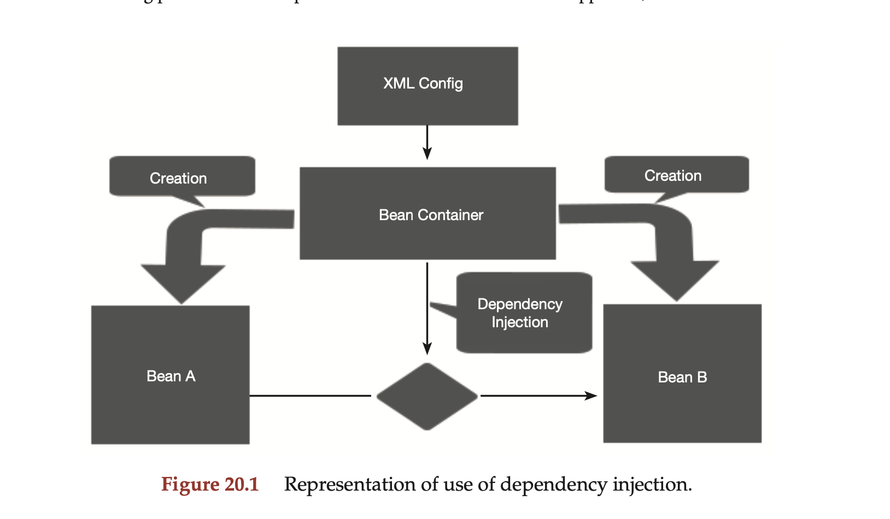

### Write a brief note on Spring Framework with a picture.

#### Spring Framework

The Spring Framework is a comprehensive, lightweight, and modular framework for building enterprise-level Java applications. It provides a wide range of functionalities and promotes good design practices through its modularity and dependency injection principles.

### Key Features:
- Dependency Injection (DI): Spring's core feature that allows the creation and - management of dependencies, promoting loose coupling and easier testing.
- Aspect-Oriented Programming (AOP): Facilitates separation of cross-cutting concerns (like logging, security) from business logic.
- Spring MVC: A robust framework for building web applications following the Model-View-Controller (MVC) pattern.
- Spring Boot: Simplifies the setup and development of new Spring applications with embedded servers, starters, and auto-configuration.
